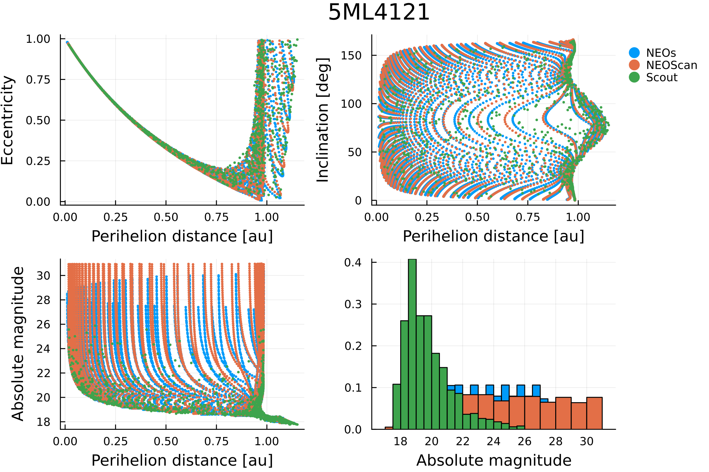
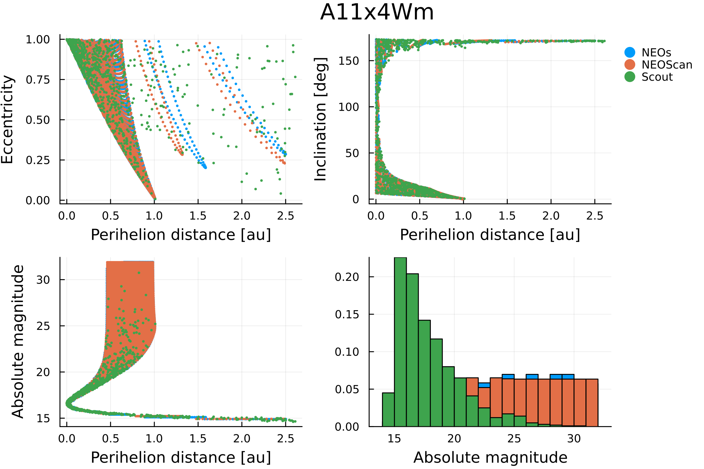
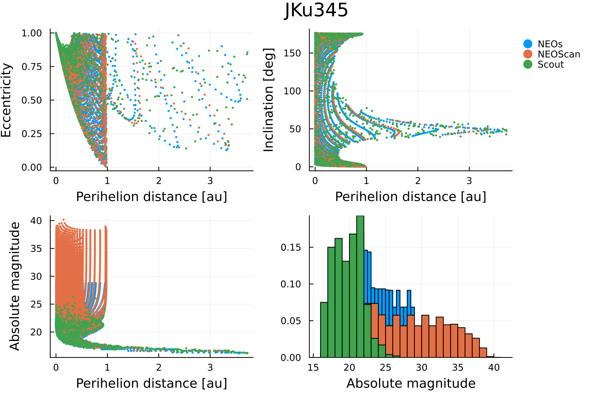
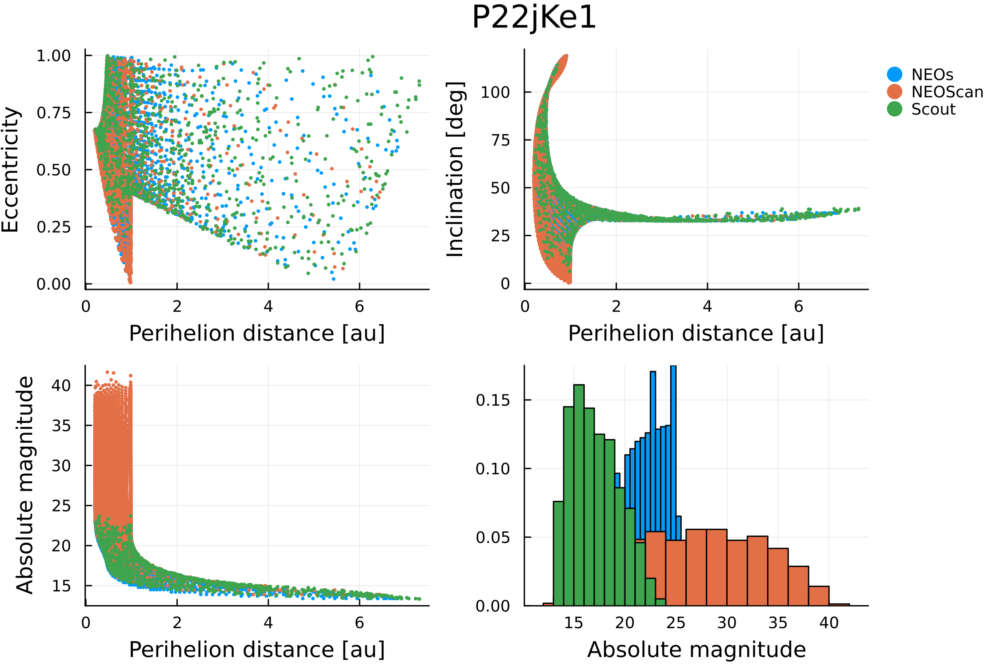

# NEOCP

NEOs can be used to sample the manifold of variations of an object listed in the [NEO Confirmation Page (NEOCP)](https://www.minorplanetcenter.net/iau/NEO/toconfirm_tabular.html) in a similar way to how services like [NEOScan (NEODyS)](https://newton.spacedys.com/neodys/NEOScan/) and [Scout (JPL)](https://cneos.jpl.nasa.gov/scout/#/) do. In particular, the `mcmov.jl` script located in the `scripts/neocp` folder of the NEOs repository, implements the algorithm described by [Spoto2018](@cite).

To run the aforementioned script, first activate the corresponding enviorment:
```julia
pkg> activate scripts/neocp
pkg> instantiate
```
Next, use the following command to print a help message explaining all the argments that the script can receive:
```
julia --project=scripts/neocp scripts/neocp/mcmov.jl -h
```

!!! tip "Paralellism"
    The `mcmov.jl` script can leverage both distributed and multi-threaded paralellism to speed up the computations. We highly recommend at least using multiple threads to run the script.

Below, we illustrate the results obtained with the `mcmov.jl` script for four objects that were listed in the NEOCP on January 3rd, 2025: 5ML4121, A11x4Wm, JKu345 and P22jKe1. These results can be reproduced by substituting the corresponding designation in the `{}` of the following command:
```
julia -t 5 --project=scripts/neocp scripts/neocp/mcmov.jl -i {} -o {}.txt -s log --Nx 100 --Ny 100 --maxchi 5.0 --nominal false --scout --neoscan
```









!!! note
    In the figures above, the main differences between NEOs, NEOScan and Scout are due to the sampling strategy. On one hand, both NEOs and NEOScan follow [Spoto2018](@cite) and use a square grid; however, NEOScan performs a second sampling with a refined grid, resulting in a denser mesh. On the other hand, Scout follows the systematic ranging approach described by [Farnocchia2015b](@cite).

## References
```@bibliography
Pages = ["neocp.md"]
Canonical = false
```